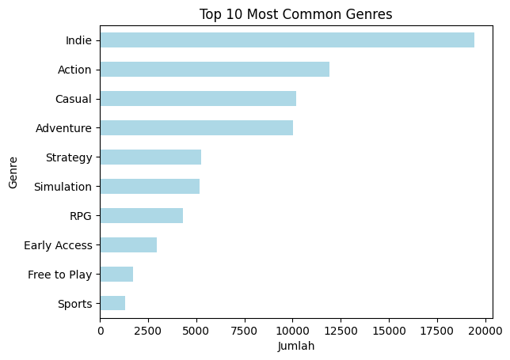
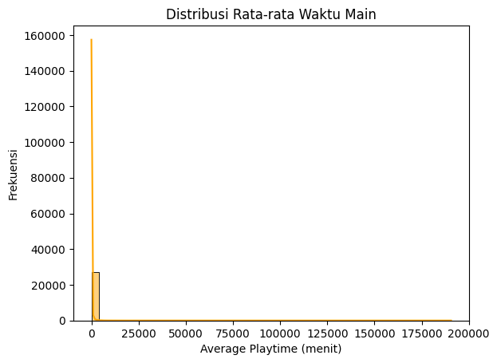
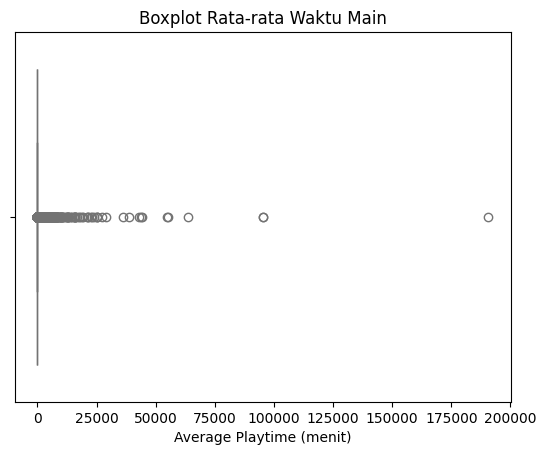
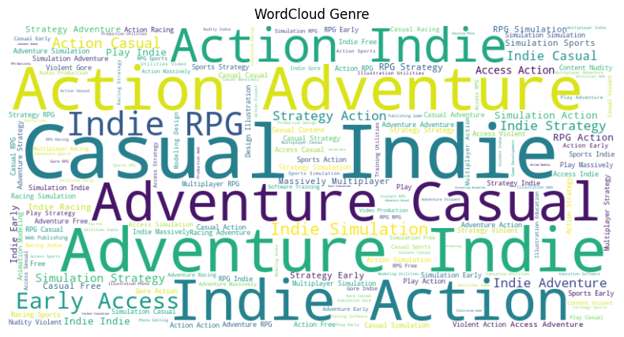
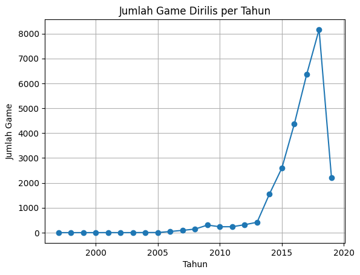

# Laporan Proyek Machine Learning - Rizky Maulana Saputra

## Project Overview

Dalam era digital, industri game mengalami pertumbuhan pesat dengan ribuan judul yang tersedia di berbagai platform. Tantangan utama bagi pengguna adalah menemukan game yang sesuai dengan preferensi mereka di tengah lautan pilihan tersebut. Sistem rekomendasi dapat menjadi solusi yang efektif untuk menyaring informasi dan memberikan rekomendasi personalisasi kepada pengguna.

Masalah ini penting untuk diselesaikan karena dapat meningkatkan pengalaman pengguna dan meningkatkan loyalitas terhadap platform distribusi game

## Business Understanding

### Problem Statements

Menjelaskan pernyataan masalah:
- Bagaimana memberikan rekomendasi game yang relevan berdasarkan deskripsi konten game?
- Bagaimana meningkatkan akurasi rekomendasi menggunakan pendekatan content-based filtering?

### Goals

Menjelaskan tujuan proyek yang menjawab pernyataan masalah:
- Membangun sistem rekomendasi berbasis content-based filtering menggunakan TF-IDF dan cosine similarity.
- Memberikan 10 rekomendasi game paling relevan berdasarkan input judul game.

### Solution statements
- Menggunakan metode TF-IDF untuk ekstraksi fitur dari deskripsi teks.
- Menggunakan cosine similarity untuk mengukur kemiripan antar game berdasarkan vektor TF-IDF.
- Menyimpan hasil perhitungan similarity untuk menghasilkan top-10 recommendation.

## Data Understanding
Dataset yang digunakan merupakan dataset dari Steam Video Game Dataset yang tersedia secara publik melalui Kaggle: https://www.kaggle.com/datasets/nikdavis/steam-store-games.

Dataset ini terdiri dari 27.075 entri game dengan beberapa fitur utama:
- appid: ID unik dari setiap game
- name: Nama dari game
- release_date: Tanggal rilis
- english : Menandakan apakah game tersebut support bahasa inggris
- developer: Developer game
- publisher: Publisher game
- platforms : Platform yang support untuk memainkan game
- required_age : Batas umur untuk memainkan game
- categories: Kategori fitur seperti Multiplayer, Singleplayer, VR, dll
- genres: Genre game (Action, Indie, RPG, dll)
- steamspy_tags: Tag yang diberikan pengguna
- rating: Rating rata-rata (jika tersedia)
- achievements : Jumlah Achievements dari game
- positive_ratings : Jumlah rating positive dari game
- negative_ratings : Jumlah rating negative dari game
- average_playtime : Rata rata playtime dari game
- median_playtime : Nilai tengah atau Median dari game
- owners : User yang memilki game
- price : Harga dari game dalam bentuk USD
## Exploration Data Analytics
1. Pemeriksaan Struktur Data, Missing Values dan Duplicate Data : <br>
Dataset terdiri dari 27.075 baris dengan berbagai variabel seperti appid, name, release_date, english, developer, publisher, platforms, required_age, categories, genres, steamspy_tags, achievements, positive ratings, negtive ratings, average playtime, median playtime, owners, price. Hasil pengecekan menunjukkan bahwa terdapat missing values pada dataset tepatnya di kolom developer dan publisher
2. Statisktik Deskriptif :<br>
<div>
<table border="1" class="dataframe">
  <thead>
    <tr style="text-align: right;">
      <th></th>
      <th>appid</th>
      <th>english</th>
      <th>required_age</th>
      <th>achievements</th>
      <th>positive_ratings</th>
      <th>negative_ratings</th>
      <th>average_playtime</th>
      <th>median_playtime</th>
      <th>price</th>
    </tr>
  </thead>
  <tbody>
    <tr>
      <th>count</th>
      <td>2.707500e+04</td>
      <td>27075.000000</td>
      <td>27075.000000</td>
      <td>27075.000000</td>
      <td>2.707500e+04</td>
      <td>27075.000000</td>
      <td>27075.000000</td>
      <td>27075.00000</td>
      <td>27075.000000</td>
    </tr>
    <tr>
      <th>mean</th>
      <td>5.962035e+05</td>
      <td>0.981127</td>
      <td>0.354903</td>
      <td>45.248864</td>
      <td>1.000559e+03</td>
      <td>211.027147</td>
      <td>149.804949</td>
      <td>146.05603</td>
      <td>6.078193</td>
    </tr>
    <tr>
      <th>std</th>
      <td>2.508942e+05</td>
      <td>0.136081</td>
      <td>2.406044</td>
      <td>352.670281</td>
      <td>1.898872e+04</td>
      <td>4284.938531</td>
      <td>1827.038141</td>
      <td>2353.88008</td>
      <td>7.874922</td>
    </tr>
    <tr>
      <th>min</th>
      <td>1.000000e+01</td>
      <td>0.000000</td>
      <td>0.000000</td>
      <td>0.000000</td>
      <td>0.000000e+00</td>
      <td>0.000000</td>
      <td>0.000000</td>
      <td>0.00000</td>
      <td>0.000000</td>
    </tr>
    <tr>
      <th>25%</th>
      <td>4.012300e+05</td>
      <td>1.000000</td>
      <td>0.000000</td>
      <td>0.000000</td>
      <td>6.000000e+00</td>
      <td>2.000000</td>
      <td>0.000000</td>
      <td>0.00000</td>
      <td>1.690000</td>
    </tr>
    <tr>
      <th>50%</th>
      <td>5.990700e+05</td>
      <td>1.000000</td>
      <td>0.000000</td>
      <td>7.000000</td>
      <td>2.400000e+01</td>
      <td>9.000000</td>
      <td>0.000000</td>
      <td>0.00000</td>
      <td>3.990000</td>
    </tr>
    <tr>
      <th>75%</th>
      <td>7.987600e+05</td>
      <td>1.000000</td>
      <td>0.000000</td>
      <td>23.000000</td>
      <td>1.260000e+02</td>
      <td>42.000000</td>
      <td>0.000000</td>
      <td>0.00000</td>
      <td>7.190000</td>
    </tr>
    <tr>
      <th>max</th>
      <td>1.069460e+06</td>
      <td>1.000000</td>
      <td>18.000000</td>
      <td>9821.000000</td>
      <td>2.644404e+06</td>
      <td>487076.000000</td>
      <td>190625.000000</td>
      <td>190625.00000</td>
      <td>421.990000</td>
    </tr>
  </tbody>
</table>
</div>

Insigt :<br>
- Harga Game rata rata sekitar $6, tapi mayoritas game dihargai dibawah $4. Banyak juga yang gratis
- Rating positif sangat tinggi dan skewed: beberapa game memiliki rating > 2juta, padahal median hanya 24. Ini mengindikasikan distribusi yang tidak merata
- Playtime sangat bervariasi, dan mayoritas game memiliki nilai median playtime = 0, artinya banyak game tidak dimainkan lama atau hanya dicoba sebentar.
- Age restriction: sebagian besar game tidak memiliki batasan usia (nilai median = 0), hanya sebagian kecil yang memerlukan umur ≥ 18.
1. Cek Outlier :<br>
   Setelah dilakukan analisis outlier menggunakan metode Interquartile Range (IQR), ditemukan sejumlah data yang berada di luar batas normal. Berikut adalah jumlah outlier pada masing-masing fitur numerik:<br>
   - Kolom price : 1975 Outlier
   - Kolom positive_ratings : 4286 Outlier
   - Kolom negative_ratings : 3957 Outlier
   - Kolom required_age : 596 Outlier
   - Kolom achievements : 1695 Outlier
2. Visual
   - Top 10 Genre Terpopuler<br>
    Insight: Genre seperti Action, Indie, dan Adventure menjadi yang paling dominan dalam dataset game ini.
    
    - Distribusi Average Playtime<br>
    Insight: Sebagian besar game memiliki waktu main yang sangat rendah, dengan beberapa game yang sangat lama dimainkan (outlier).
    
    - Boxplot Average Playtime<br>
    Insight: Outlier cukup ekstrem di sebelah kanan, mengindikasikan beberapa game dimainkan hingga ratusan ribu menit.
    
    - WordCloud Genre<br>
    Insight: Genre populer seperti Action, Adventure, dan Indie muncul dominan secara visual, memperkuat hasil pada analisis bar chart sebelumnya.
    
    - Jumlah Game Dirilis per Tahun<br>
    Insight: Terlihat adanya tren peningkatan jumlah game dari tahun ke tahun, terutama mulai tahun 2014-an. Namun, ada penurunan signifikan di beberapa tahun terakhir yang kemungkinan karena data belum lengkap.
    


## Data Preparation
1. Handling Missing Values :<br>
   Seluruh baris yang memiliki data kosong dihapus menggunakan df.dropna() untuk menjaga konsistensi data
   ```py
   df = df.dropna()
   ```
2. Menghapus kolom yang tidak relevan dan konversi tipe data :<br>
   - Kolom appid dihapus karena tidak memiliki kontribusi terhadap proses pemodelan
   - Kolom numerik seperti achievements, positive_ratings, negative_ratings, average_playtime, median_playtime, price dikonversi ke tipe float agar dapat digunakan untuk analisis dan transformasi numerik
    ```py
    df = df.drop(columns=['appid'], axis=1)
    df['achievements'] = df['achievements'].astype(float)
    df['positive_ratings'] = df['positive_ratings'].astype(float)
    df['negative_ratings'] = df['negative_ratings'].astype(float)
    df['average_playtime'] = df['average_playtime'].astype(float)
    df['median_playtime'] = df['median_playtime'].astype(float)
    df['price'] = df['price'].astype(float)
    df['combined'] = df['genres'].fillna('') + ' ' + df['developer'].fillna('')
    ```  
3. Outlier :<br>
   Untuk fitur numerik (price, positive_ratings, negative_ratings, required_age, achievements), dilakukan penanganan outlier menggunakan metode IQR. Nilai yang berada diluar rentang Q1-1.5xIQR dan Q3+1.5xIQR di cap ke batas tersebut.
   ```py
   numeric = df[['price', 'positive_ratings', 
              'negative_ratings', 'required_age', 'achievements']]
    def outlier_handling(data):
        Q1 = df[data].quantile(0.25)
        Q3 = df[data].quantile(0.75)
        IQR = Q3 - Q1
        lower = Q1 - 1.5 * IQR
        upper = Q3 + 1.5 * IQR
        df.loc[df[data] > upper, data] = upper
        df.loc[df[data] < lower, data] = lower

    for i in numeric:
        outlier_handling(i)
        check_outlier(i)
   ```
4. Vectorization dan Perhitungan Cosine Similarity :<br>
   Data pada kolom combined di transformasi menjadi bentuk vektor menggunakan TF-IDF agar dapat dihitung kemiripan. Hasil dari TF-IDF digunakan untuk menghitung cosine similarity, yang menjadi dasar penilaian kemiripan antar game.
   ```py
   tfidf = TfidfVectorizer(stop_words='english')
    tfidf_matrix = tfidf.fit_transform(df['combined'])
    cosine_sim = cosine_similarity(tfidf_matrix, tfidf_matrix)
   ```


## Modeling
Pendekatan utama dalam proyek ini adalah Content-Based Filtering menggunakan teknik TF-IDF dan Cosine Similarity. Pendekatan ini fokus pada konten deskriptif dari game, seperti genre dan developer, untuk memberikan rekomendasi yang relevan.

Algoritma: TF-IDF + Cosine Similarity
1. TF-IDF (Term Frequency-Inverse Document Frequency) digunakan untuk mengubah teks dalam kolom combined (gabungan genres dan developer) menjadi representasi numerik.

2. Cosine Similarity digunakan untuk mengukur kemiripan antar game berdasarkan vektor TF-IDF tersebut.
```py
def get_recommendations(name, cosine_sim=cosine_sim):
    idx = df[df['name'].str.lower() == name.lower()].index
    if len(idx) == 0:
        return f"Game '{name}' tidak ditemukan di dataset."
    idx = idx[0]
    sim_scores = list(enumerate(cosine_sim[idx]))
    sim_scores = sorted(sim_scores, key=lambda x: x[1], reverse=True)
    sim_scores = sim_scores[1:11]
    game_indices = [i[0] for i in sim_scores]
    return df[['name', 'genres', 'developer']].iloc[game_indices]
```
Kelebihan :<br>
- Tidak memerlukan interaksi atau data pengguna
- Mengandalkan deskripsi konten yang tersedia

Kekurangan :<br>
- Tidak memperhitungkan popularitas atau rating pengguna
- Hanya fokus pada kemiripan konten, bukan perilaku pengguna

## Evaluation

Karena sistem ini menggunakan pendekatan content-based filtering tanpa data interaksi pengguna (seperti klik, rating, atau waktu bermain), maka evaluasi dilakukan secara **kualitatif/manual**.

Metode evaluasi yang dilakukan:
1. **Manual Inspection**: Menguji beberapa judul game populer, lalu mengecek apakah hasil rekomendasinya relevan berdasarkan genre, developer, atau kontennya.
2. **Top-N Relevance Check**: Mengamati apakah daftar 10 teratas memiliki kemiripan konten dengan judul input.

Contoh:
Untuk input "Grand Theft Auto V", sistem merekomendasikan:
- Manhunt
- Grand Theft Auto
- Grand Theft Auto 2
- Grand Theft Auto IV
- Grand Theft Auto : Episodes from Liberty City
- Grand Theft Auto III
- Grand Theft Auto : Vice City
- Grand Theft Auto : San Andreas
- Max Payne 3
- L.A. Noire : the VR Case Files

Hasil ini dianggap **relevan**, karena game-game tersebut memiliki genre aksi dunia terbuka (open-world action) yang serupa.

> Karena tidak ada data relevansi eksplisit atau preferensi pengguna, maka metrik kuantitatif seperti Precision@K atau NDCG tidak dapat digunakan pada proyek ini.

✅ Apakah Sudah Menjawab Problem Statements?<br>
Yes.<br>
Problem statement menyatakan bahwa pengguna kesulitan menemukan game yang sesuai dengan preferensi mereka di tengah banyaknya pilihan game di pasar.
Model ini berhasil memberikan rekomendasi yang relevan dan personalized berdasarkan genre dan developer, sehingga menjawab permasalahan utama tersebut.


✅ Apakah Berhasil Mencapai Goals?:<br>
Yes.<br>
Tujuan proyek adalah membangun sistem rekomendasi sederhana yang mampu:
- Menganalisis data game berdasarkan metadata.
- Memberikan rekomendasi game yang mirip dengan input user.
Model telah mencapai kedua tujuan tersebut dengan pendekatan yang cukup ringan namun efektif (tanpa memerlukan user-item rating atau deep learning).

✅ Apakah Solution Statements Berdampak?<br>
Yes, to some extent.<br>
Pendekatan content-based recommendation menggunakan TF-IDF berhasil memberikan:
- Rekomendasi game yang mirip dari segi konten.
- Hasil yang bisa ditafsir secara eksplisit oleh pengguna (karena berbasis genre/developer).

Dampaknya: sistem ini dapat diintegrasikan ke dalam platform pencarian game untuk membantu user dalam eksplorasi konten yang sesuai minatnya. Meski belum sepenuhnya personalized (karena belum menggunakan feedback pengguna), sistem ini tetap berdampak positif pada user experience.


**---Ini adalah bagian akhir laporan---**
